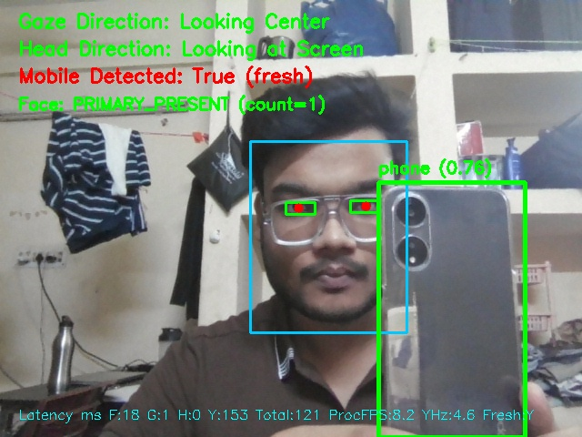
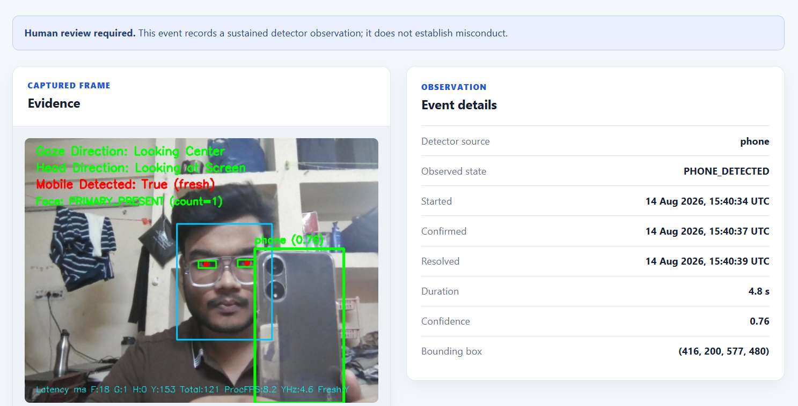

# ProctorVision

**AI-Assisted Online Proctoring & Review System**

[](https://github.com/ayushgoel001/proctorvision/actions/workflows/ci.yml)
[](https://www.python.org/)
[](LICENSE)

**Author:** Ayush Goel

ProctorVision is a local computer-vision system for monitoring webcam or recorded-video sessions and surfacing potentially suspicious observations for later human review.

It combines **MediaPipe facial landmarks, gaze estimation, relative head-pose analysis, face tracking, and YOLO-based phone detection** with a temporal alert-processing layer that converts noisy frame-level observations into sustained review events.

Confirmed events are persisted in **SQLite** with evidence screenshots and can be inspected through a **FastAPI REST API and browser-based review dashboard**.

> **Flags are observations, not proof of misconduct.**
> ProctorVision is designed as an assistive review system rather than an automated cheating-determination system.

---

## Screenshots

### Live Monitoring



Real-time monitoring view showing candidate tracking together with gaze, head-pose, face-presence, and phone-detection signals.

### Session Review Dashboard



Browser-based dashboard for reviewing completed or active sessions, confirmed events, timestamps, and associated evidence.

---

## Engineering Highlights

* Built a **modular-monolith architecture** separating computer-vision inference, temporal event processing, persistence, and review.
* Shared face/landmark computation between gaze and head-pose detectors instead of repeating expensive landmark inference.
* Improved measured pipeline throughput by **~19% in a controlled optimization benchmark** by eliminating redundant face/landmark processing.
* Implemented **session-scoped primary-face tracking** to prevent monitoring from silently switching to another detected person.
* Designed a temporal **AlertEngine state machine** with configurable duration, grace-period, and cooldown semantics.
* Persisted session/event metadata transactionally using **SQLite**, while storing evidence images separately on disk.
* Built **FastAPI REST endpoints** and a server-rendered dashboard for session and evidence review.
* Added **79 automated unit, integration, API, dashboard, persistence, and pipeline tests**.
* Added **GitHub Actions CI**, Ruff linting, deterministic integration testing, dependency separation, and model checksum validation.
* Profiled the complete CPU vision pipeline and identified **YOLO inference as the primary runtime bottleneck**.

---

## System Architecture

```text
Camera / Recorded Video
          │
          ▼
┌─────────────────────────────┐
│     SurveillanceEngine      │
│                             │
│  ├─ Shared FrameContext     │
│  ├─ Primary-face tracking   │
│  ├─ GazeDetector            │
│  ├─ HeadPoseDetector        │
│  ├─ PhoneDetector           │
│  └─ Face-presence analysis  │
└──────────────┬──────────────┘
               │
               ▼
       FrameProcessingResult
               │
               │ DetectionResult[]
               ▼
┌─────────────────────────────┐
│         AlertEngine         │
│                             │
│ duration + grace + cooldown │
└──────────────┬──────────────┘
               │
               ▼
        SessionService
               │
        ┌──────┴──────┐
        ▼             ▼
      SQLite      Evidence Images
        │
        ▼
      FastAPI
        │
        ▼
 Server-rendered Dashboard
```

The computer-vision layer does **not** directly control persistence or the UI.

Each detector produces structured `DetectionResult` objects. The `AlertEngine` interprets those observations over time, while `SessionService` manages session state and persistence.

This keeps computer vision, temporal decision logic, storage, and presentation independently testable.

---

## Detection Pipeline

ProctorVision currently monitors five classes of observations.

### Gaze Direction

MediaPipe facial landmarks are used to estimate relative eye/gaze displacement.

The detector produces structured gaze states rather than directly creating alerts.

### Head Pose

Facial landmarks are used to estimate relative head orientation against the candidate's calibrated forward-facing position.

### Face Presence

The system observes whether the tracked primary candidate remains visible.

Temporary face-detection failures are handled by the temporal alert layer instead of immediately producing an event.

### Multiple Faces

Additional visible faces are reported independently of primary-candidate tracking.

### Phone Detection

A local YOLO checkpoint detects visible mobile phones.

For CPU efficiency, phone inference is sampled rather than executed on every frame.

---

## Shared Frame Processing

Gaze estimation and head-pose estimation both require facial landmarks.

A naïve implementation performs landmark detection independently for both detectors:

```text
Frame
 ├─ Face landmarks → Gaze
 └─ Face landmarks → Head pose
```

ProctorVision instead computes this information once:

```text
Frame
     │
     ▼
Shared FrameContext
     │
     ├─ Gaze
     └─ Head pose
```

This removes redundant face/landmark inference.

In the controlled Phase 2A optimization benchmark, average processing latency decreased from approximately:

```text
279.4 ms/frame → 234.9 ms/frame
```

corresponding to approximately **19% higher measured throughput** for that benchmark.

This number describes the specific optimization experiment and is **not** an accuracy measurement or a hardware-independent performance guarantee.

---

## Primary-Candidate Tracking

When multiple faces are visible, simply selecting the largest face every frame can silently switch monitoring from one person to another.

ProctorVision therefore maintains a **session-scoped primary candidate**.

During initial calibration, the largest detected face is acquired as the primary candidate.

Subsequent frames associate detections using geometric similarity based on:

* bounding-box Intersection over Union (IoU),
* normalized center distance,
* face-area similarity.

If the primary candidate temporarily disappears, the system retains the previous geometry instead of immediately adopting another visible face.

This mechanism improves tracking continuity but does **not** perform biometric identity verification.

---

## Temporal Alert Engine

Frame-level computer-vision predictions are inherently noisy.

ProctorVision therefore does not persist an event immediately when a single suspicious frame appears.

Instead, every alert rule passes through a temporal state machine:

```text
IDLE
  │
  │ suspicious observation
  ▼
PENDING
  │
  │ sustained for minimum duration
  ▼
CONFIRMED
  │
  │ clear beyond grace period
  ▼
RESOLVED
```

Rules support:

* **minimum duration** — observation must persist before confirmation,
* **clear-frame grace** — short interruptions do not immediately resolve an event,
* **cooldown** — prevents immediate repeated events.

Default monitored event types include:

* `GAZE_DEVIATION`
* `HEAD_DEVIATION`
* `PHONE_DETECTED`
* `NO_FACE`
* `MULTIPLE_FACES`

The alert clock is injectable, allowing deterministic tests without waiting for real wall-clock time.

---

## Session Lifecycle

Each monitoring run is represented as a session.

```text
CREATED
    │
    ▼
CALIBRATING
    │
    ▼
RUNNING
    │
    ▼
STOPPED
```

Failures may transition the session to:

```text
FAILED
```

Events are scoped to the session that generated them.

A confirmed event creates:

1. one event record,
2. one evidence screenshot.

When the observation clears, the same database record is updated rather than creating another event.

---

## Persistence and Evidence

ProctorVision uses SQLite for durable local persistence.

```text
data/
├── surveillance.db
├── evidence/
│   └── <session-id>/
│       └── <event-id>.jpg
└── images/
    ├── live-monitoring.png
    └── session-dashboard.png
```

SQLite stores session/event metadata and the **relative evidence path**.

Evidence images themselves remain on disk.

`data/images/` contains only intentionally public documentation screenshots and is separate from runtime evidence.

Event insertion and session event-count updates are performed transactionally.

Wall-clock timestamps persisted in the database use UTC and are kept separate from the monotonic clock used by temporal alert processing.

---

## Review API and Dashboard

The monitoring process and review application intentionally have separate responsibilities.

```text
Monitoring process
main.py
   │
   ▼
SurveillanceEngine
   │
   ▼
AlertEngine
   │
   ▼
SessionService
   │
   ▼
SQLite


Browser
   │
   ▼
FastAPI
   │
   ▼
SQLite Repository
   │
   ▼
Dashboard / Jinja Templates
```

The API/dashboard **does not run computer-vision inference**.

The monitoring application writes sessions and events to SQLite, while the FastAPI application reads the persisted information for review.

### Dashboard routes

```text
GET /
GET /dashboard/sessions/{session_id}
GET /dashboard/events/{session_id}/{event_id}
```

REST endpoints remain independently available through FastAPI.

Evidence-file resolution is centralized and validates session/event ownership to prevent cross-session access and path traversal.

---

## Performance Benchmark

A production-pipeline benchmark is included at:

```text
benchmarks/system_benchmark.py
```

A recent controlled CPU benchmark using a fixed **1920×1080 recorded video** produced the following throughput across five independent 300-frame runs:

```text
Run 1: 8.65 FPS
Run 2: 9.43 FPS
Run 3: 9.11 FPS
Run 4: 8.93 FPS
Run 5: 8.71 FPS
```

Average observed processing throughput:

```text
≈ 8.97 FPS
```

The benchmark showed that **YOLO phone detection dominates CPU inference latency**, while gaze and head-pose calculations themselves contribute comparatively little processing overhead.

Benchmark results are:

* hardware-specific,
* model-version-specific,
* input-resolution-specific,
* intended for performance profiling rather than model-accuracy evaluation.

They should not be interpreted as universal real-time guarantees.

---

## Requirements

* Python **3.11**
* Webcam for live monitoring, or a local video file
* Local model assets described in [`model/README.md`](model/README.md)

---

## Quick Start — Windows

Clone the repository:

```powershell
git clone https://github.com/ayushgoel001/proctorvision.git
cd proctorvision
```

Create a Python 3.11 virtual environment:

```powershell
py -3.11 -m venv .venv
```

If PowerShell blocks activation scripts:

```powershell
Set-ExecutionPolicy -Scope Process -ExecutionPolicy Bypass
```

Activate the environment:

```powershell
.\.venv\Scripts\Activate.ps1
```

Upgrade pip:

```powershell
python -m pip install --upgrade pip
```

Install runtime dependencies:

```powershell
python -m pip install -r requirements.txt
```

If `py -3.11` is unavailable, install Python 3.11 and check the available runtimes with:

```powershell
py --list
```

---

## Model Setup

Before running the monitoring pipeline, place the required model assets inside:

```text
model/
├── face_landmarker.task
└── best_yolov12.pt
```

See [`model/README.md`](model/README.md) for setup and checksum information.

The application does not automatically download model files.

Startup validation reports clear errors when a required model is:

* missing,
* corrupted,
* incompatible,
* configured with an unexpected phone-class mapping.

### Phone-model distribution

`best_yolov12.pt` is intentionally **not distributed in this repository**.

Its original training-data provenance and redistribution rights have not been sufficiently established.

The local checkpoint may still be used by the project locally, but the repository does not make unsupported claims regarding redistribution rights.

See [`model/README.md`](model/README.md) for details.

---

## Run Monitoring

### Default webcam

```powershell
python main.py
```

### Another camera

```powershell
python main.py --source 1
```

### Recorded video

```powershell
python main.py --source Demo_vid/controlled-exam.mp4
```

Absolute paths are also supported:

```powershell
python main.py --source "C:\videos\controlled-exam.mp4"
```

During startup:

1. keep one face visible,
2. look naturally toward the camera,
3. remain relatively still while calibration completes.

Press:

```text
q
```

to stop monitoring cleanly.

Enable diagnostic output only when needed:

```powershell
python main.py --debug
```

---

## Start the Review Dashboard

Open a second terminal and activate the same virtual environment.

Then run:

```powershell
python -m uvicorn api:app --host 127.0.0.1 --port 8000
```

Open:

* **Dashboard:** `http://127.0.0.1:8000/`
* **FastAPI documentation:** `http://127.0.0.1:8000/docs`
* **Health endpoint:** `http://127.0.0.1:8000/health`

The monitoring process and dashboard use the same local SQLite database.

Active `RUNNING` and `CALIBRATING` sessions refresh periodically in the browser.

No WebSocket connection or remote webcam control is required.

---

## Testing

Install development dependencies:

```powershell
python -m pip install -r requirements-dev.txt
```

Run the complete deterministic test suite:

```powershell
python -m unittest discover -s tests -v
```

Current verified suite:

```text
79 tests passing
```

The suite covers areas including:

* temporal alert behavior,
* primary-face tracking,
* session lifecycle,
* SQLite persistence,
* evidence handling,
* REST API behavior,
* dashboard routes,
* pipeline integration,
* architecture invariants.

Run Ruff:

```powershell
python -m ruff check .
```

---

## Continuous Integration

GitHub Actions automatically validates the repository on supported pushes and pull requests.

CI includes:

* Ruff static analysis,
* Python source compilation,
* deterministic automated tests.

This helps ensure that architecture and behavior remain stable as the project evolves.

---

## Project Structure

```text
proctorvision/
│
├── main.py
│   └── Monitoring application entry point
│
├── surveillance_engine.py
│   └── Per-frame CV orchestration
│
├── detectors.py
│   └── Shared structured detection-result models
│
├── alert_engine.py
│   └── Temporal event-processing state machine
│
├── session_service.py
│   └── Session lifecycle and event persistence
│
├── persistence.py
│   └── SQLite repository
│
├── api.py
│   └── FastAPI application and REST endpoints
│
├── dashboard.py
│   └── Server-rendered dashboard routes
│
├── evidence.py
│   └── Evidence-path handling and validation
│
├── config.py
│   └── Runtime configuration
│
├── benchmarks/
│   ├── system_benchmark.py
│   └── CV reliability/performance tooling
│
├── model/
│   ├── README.md
│   └── manifest.json
│
├── templates/
│   └── Jinja dashboard templates
│
├── static/
│   └── Dashboard CSS/JavaScript
│
├── tests/
│   └── Unit, integration, API, dashboard, and persistence tests
│
└── data/
    └── Runtime database/evidence and public documentation images
```

---

## Design Decisions

### Why a modular monolith?

At the current application scale, separate microservices would add networking, deployment, and operational complexity without solving an actual project requirement.

A modular monolith provides separation of concerns while keeping local deployment simple.

### Why SQLite?

ProctorVision is designed as a local single-process application.

SQLite provides:

* durable persistence,
* transactions,
* zero external database infrastructure,
* straightforward local deployment.

A separate database server would introduce unnecessary operational overhead for the current use case.

### Why a temporal AlertEngine?

Individual computer-vision frames are noisy.

Duration, grace, and cooldown semantics reduce transient detections and prevent a sustained observation from producing dozens of independent database events.

### Why shared facial landmarks?

Gaze and head-pose detectors require much of the same facial geometry.

Computing the landmark information once per frame eliminates redundant expensive work.

### Why primary-face tracking?

Selecting the largest face independently on every frame may cause the monitored candidate to change whenever another person moves closer to the camera.

Session-scoped association prevents this silent switching behavior.

---

## Limitations

ProctorVision is an engineering prototype and has known limitations.

### Computer Vision

Performance can degrade under:

* poor illumination,
* occlusion,
* extreme head orientation,
* partially visible faces,
* low-quality cameras.

Geometry-based face association improves continuity but does not prove identity.

Long occlusions or crossing faces may prevent the primary candidate from being reassociated correctly.

Phone-detection quality depends on the supplied YOLO checkpoint.

### Performance

YOLO inference is currently the primary CPU bottleneck.

Actual throughput depends on:

* CPU/GPU hardware,
* video resolution,
* model version,
* camera characteristics,
* inference configuration.

GPU inference or a lighter detector could improve throughput.

### System

The current version is intended for local/single-process use.

It does not currently provide:

* authentication,
* authorization,
* cloud multi-user deployment,
* remote webcam control,
* population-scale fairness evaluation.

The FastAPI service should remain bound to:

```text
127.0.0.1
```

unless appropriate authentication and deployment security are added.

---

## Privacy and Responsible Use

ProctorVision processes potentially sensitive webcam/video information.

Runtime data such as:

* database files,
* evidence screenshots,
* private videos,
* model binaries,

should not be committed to source control.

The repository `.gitignore` excludes these runtime/private artifacts.

Only deliberately selected, non-sensitive screenshots under:

```text
data/images/
```

are intended for public documentation.

Most importantly:

> **A ProctorVision event indicates that a configured visual observation persisted for a specified period. It does not establish cheating, intent, identity, or misconduct.**

Any consequential decision should involve appropriate human review and additional context.

---

## Future Improvements

Potential future work includes:

* GPU-accelerated inference,
* lighter or more efficient phone-detection models,
* stronger identity-aware candidate association,
* controlled accuracy and robustness evaluation using a labeled dataset,
* authenticated multi-user review,
* production database support for larger deployments.

These are intentionally outside the current local placement-project scope.

---

## License

Copyright © 2026 Ayush Goel.

The **project source code** is licensed under the [MIT License](LICENSE).

Local model binaries are not included under the repository's MIT license and are not distributed with the source repository. They remain subject to their respective terms and the provenance guidance documented in [`model/README.md`](model/README.md).
